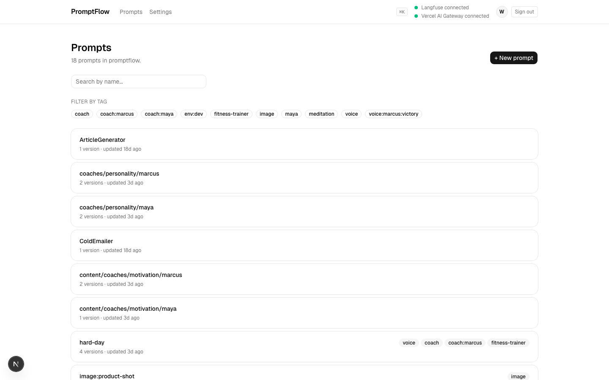

# PromptFlow

A better UI for [Langfuse](https://langfuse.com) prompt management. Open core.

PromptFlow is a frontend for the prompt-management half of Langfuse, with the UX bent toward authoring and iteration: tag-first organisation and an integrated playground.

Langfuse is the storage layer; PromptFlow is the editor. The same prompts get consumed by separate iOS apps (different repos) to demonstrate remote prompt management for production apps.

> 🚧 In active development. Web app + CLI + MCP server + first iOS consumer (Cadence) are live.



## Ecosystem

One Langfuse-backed prompt registry, multiple consumers:

- **Web** — `apps/web`. Authoring UI.
- **CLI** — [`@promptflow/cli`](apps/cli) — `bun run --filter cli dev prompts list` today, `npx @promptflow/cli prompts list` once published. Manage prompts from the terminal.
- **MCP server** — [`@promptflow/mcp-server`](apps/mcp-server) — register with Claude Desktop / Claude Code / Cursor; your prompts become invocable MCP Prompts.
- **Cadence** (iOS) — [github.com/MartinW/cadence](https://github.com/MartinW/cadence). Reads `voice:*` tagged prompts aloud via streamed audio (`openai/gpt-4o-audio-preview` through OpenRouter). Demonstrates the "remote prompt management" thesis — edit in the web UI, behaviour changes in the app on next launch.

## Architecture

```
   ┌──────────────────┐  ┌──────────────────┐  ┌──────────────────┐
   │  apps/web        │  │  apps/cli        │  │  apps/mcp-server │
   │  (Next.js 16)    │  │  (Commander)     │  │  (MCP stdio)     │
   │  Authoring UI    │  │  Terminal CRUD   │  │  Prompts as MCP  │
   │  + Playground    │  │  + run via OR    │  │  prompts/tools   │
   └────────┬─────────┘  └────────┬─────────┘  └────────┬─────────┘
            │                     │                     │
            └────────┬────────────┴──────┬──────────────┘
                     │  consume          │
   ┌─────────────────▼────────────────┐  │  Swift port mirrors
   │  packages/core (MIT — 45 tests) │  │  in github.com/
   │  ─ createClient()  Langfuse SDK │  │  MartinW/cadence
   │  ─ Tag namespace   voice/image…  │  │  (separate repo)
   │  ─ template + SSML validators    │  │
   │  ─ PromptFlowError typed kinds   │  │
   └─────────────────┬────────────────┘  │
                     │ HTTPS              │ HTTPS
                     ▼                    ▼
          ┌──────────────────┐  ┌──────────────────────────────┐
          │  Langfuse API    │  │  OpenRouter / Vercel AI GW   │
          │  (BYO keys)      │  │  (env-selected; Claude/GPT)  │
          └──────────────────┘  └──────────────────────────────┘
```

## Quickstart

Requires [bun](https://bun.com) ≥ 1.1 and Node ≥ 20.

```bash
git clone https://github.com/MartinW/promptflow.git
cd promptflow
bun install
cp apps/web/.env.example apps/web/.env.local
# minimum: fill in LANGFUSE_PUBLIC_KEY + LANGFUSE_SECRET_KEY
# optional: OPENROUTER_API_KEY (or AI_GATEWAY_API_KEY for Vercel AI SDK) for the Playground
bun run dev
# → http://localhost:3003
```

The dev server runs open by default — no sign-in is required. See **Authentication** below to gate access.

## Configuration

Bring your own keys. Set in `apps/web/.env.local`:

| Variable | Required | Purpose |
|---|---|---|
| `LANGFUSE_PUBLIC_KEY` | yes | Langfuse project public key |
| `LANGFUSE_SECRET_KEY` | yes | Langfuse project secret key (write access) |
| `LANGFUSE_HOST` | no | Defaults to `https://cloud.langfuse.com` |
| `OPENROUTER_API_KEY` | optional | Required for Playground streaming |
| `AI_GATEWAY_API_KEY` | optional | Experimental: when set, the Playground streams via Vercel AI SDK + AI Gateway instead of OpenRouter (takes priority if both are set). Sends AI SDK telemetry to Langfuse via the `@langfuse/otel` span processor. |
| `AUTH_SECRET` | optional | Enables Google sign-in when all three `AUTH_*` vars are set. Generate with `bunx auth secret`. |
| `AUTH_GOOGLE_ID` / `AUTH_GOOGLE_SECRET` | optional | Google OAuth credentials (see Authentication below). |
| `AUTH_ALLOWED_EMAILS` | optional | Comma-separated email allowlist. Only relevant when auth is enabled. Blank = no email restriction. |
| `AUTH_ALLOWED_EMAIL_DOMAINS` | optional | Comma-separated domain allowlist. Only relevant when auth is enabled. Blank = no domain restriction. If both `EMAILS` and `DOMAINS` are blank, any Google account can sign in. |

If any keys are missing, the app renders graceful "not configured" states instead of crashing.

## Authentication

PromptFlow implements **localhost-open / production-locked** authentication:

- **Localhost / development** (fail-open): When running on `localhost`, `127.0.0.1`, `[::1]`, or `NODE_ENV=development` without Vercel production, missing auth config keeps the app usable without login. This provides a friction-free local development experience.

- **Production / public deployments** (fail-closed): When deployed publicly (`VERCEL_ENV=production` or `NODE_ENV=production` with a non-loopback host), the app **requires full authentication configuration**. Without it, all protected routes return a clear 503 error page with setup instructions. This prevents accidentally exposing your Langfuse data and AI API quota.

### Threat model

Running without auth on a public URL allows anyone who finds it to:
- Read, create, update, and delete your Langfuse prompts
- Execute playground requests that burn through your OpenRouter / AI Gateway quota
- View prompt history and trace data

**Never deploy to a public URL without either:**
1. Configuring authentication (below), OR
2. Putting the app behind a VPN, Cloudflare Access, or similar network-level protection

There is no built-in rate limiting.

CLI and MCP server are unaffected by web auth — they call Langfuse directly with their own credentials.

### Setup (required for production)

To enable Google sign-in, set **all** of the following environment variables:

1. **Generate `AUTH_SECRET`:** `bunx auth secret` (writes to `.env.local`, or copy into `.env`)
2. **Google OAuth:** [Google Cloud Console](https://console.cloud.google.com/apis/credentials) → *Create Credentials* → *OAuth client ID* → Web application. Add authorized redirect URIs:
   - `http://localhost:3003/api/auth/callback/google` (dev)
   - `https://<your-prod-host>/api/auth/callback/google` (prod)
   
   Copy the client ID and secret into `AUTH_GOOGLE_ID` and `AUTH_GOOGLE_SECRET`.

3. **Restrict access (required for production):** Set at least one of:
   - `AUTH_ALLOWED_EMAILS` — comma-separated email allowlist (e.g., `alice@example.com,bob@example.com`)
   - `AUTH_ALLOWED_EMAIL_DOMAINS` — comma-separated domain allowlist (e.g., `example.com,acme.org`)
   
   Production deployments **require** an allowlist to prevent "any Google account" access.

**Partial config behavior:**
- **Local/dev:** Missing auth config = no authentication required (fail-open for easy local development)
- **Production:** Missing any of `AUTH_SECRET`, `AUTH_GOOGLE_ID`, `AUTH_GOOGLE_SECRET`, or both allowlist vars = 503 error page (fail-closed)

The middleware intercepts requests before they reach protected routes and enforces authentication at the Proxy level. Additionally, all server actions and API routes independently verify authentication (defense in depth).

**Self-hosters** can swap or add providers (GitHub, Email magic link, credentials, etc.) by editing `apps/web/src/auth.ts`. Auth.js supports [80+ providers](https://authjs.dev/getting-started/authentication/oauth) out of the box.

## Features

**Web** (`apps/web`)
- Prompt list with tag filtering, search, version sidebar, inline diff.
- Compose editor with optional System Prompt + User Context fields; saves text-vs-chat type automatically
- Playground — streams via OpenRouter or Vercel AI SDK + AI Gateway (env-selected), live token/cost/latency, provider-grouped model picker, per-request provider badge
- Vercel AI SDK path emits real-time traces to Langfuse via `@langfuse/otel` (same native ingest path OpenRouter uses)
- Drafts by default — explicit "Promote to production" checkbox

**CLI** (`@promptflow/cli`)
- `prompts list / get / pull / push / run / diff` and `auth` for credential management
- Streams `prompts run` output through OpenRouter
- Round-trip JSON pull → edit → push to author prompts as files

**MCP server** (`@promptflow/mcp-server`)
- Langfuse prompts mapped to MCP **Prompts** so host LLMs can invoke them by name
- 6 tools: `list_prompts`, `search_prompts`, `get_prompt_metadata`, `render_prompt`, `refresh_prompts`, `run_prompt`
- In-memory cache with stale-while-revalidate

**`@promptflow/core`** (private workspace package)
- Typed Langfuse client wrapper, tag namespace utilities, template validation + variable substitution
- 45 Vitest unit tests

## Tag conventions

PromptFlow layers conventions on Langfuse's plain-string tags. Encoded as constants in `@promptflow/core`:

| Namespace | Purpose | Example |
|---|---|---|
| `voice:` | TTS-optimised templates | `voice:greeting` |
| `image:` | Image-generation templates | `image:product-shot` |
| `eval:` | LLM-as-judge templates | `eval:helpfulness` |
| `app:` | Scope to a consumer app | `app:cadence:greeting` |
| `lang:` | Locale | `lang:en-GB` |

Tags compose: a single prompt may carry several namespaced tags, and consumers filter by AND.

## License

- Root: MIT (`LICENSE`).
- `ee/` directory and `@promptflow/ee-*` packages: Business Source License 1.1, converting to Apache 2.0 after 4 years. Source-available — read freely, can't be used commercially without a licence.

This mirrors the [Langfuse open-core model](https://langfuse.com/license).

## Contributing

Issues with bug reports, suggestions, or just kind words are appreciated.

---

Built by [Martin Wright](https://github.com/MartinW).
